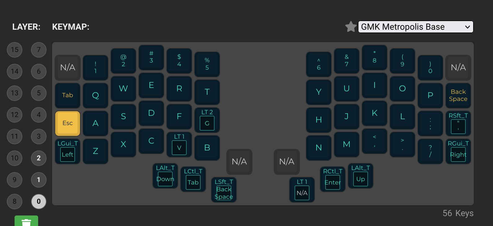
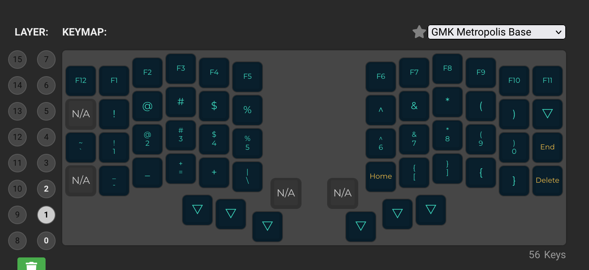
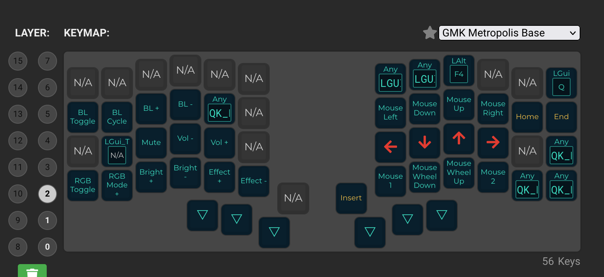

# Quantum Mechanical Keyboard Firmware

This is a keyboard firmware based on the [tmk\_keyboard firmware](https://github.com/tmk/tmk_keyboard) with some useful features for Atmel AVR and ARM controllers, and more specifically, the [OLKB product line](https://olkb.com), the [ErgoDox EZ](https://ergodox-ez.com) keyboard, and the [Clueboard product line](https://clueboard.co).

## Documentation

* [See the official documentation on docs.qmk.fm](https://docs.qmk.fm)

The docs are powered by [Docsify](https://docsify.js.org/) and hosted on [GitHub](/docs/). They are also viewable offline; see [Previewing the Documentation](https://docs.qmk.fm/#/contributing?id=previewing-the-documentation) for more details.

You can request changes by making a fork and opening a [pull request](https://github.com/qmk/qmk_firmware/pulls), or by clicking the "Edit this page" link at the bottom of any page.

## Supported Keyboards

* [Planck](/keyboards/planck/)
* [Preonic](/keyboards/preonic/)
* [ErgoDox EZ](/keyboards/ergodox_ez/)
* [Clueboard](/keyboards/clueboard/)
* [Cluepad](/keyboards/clueboard/17/)
* [Atreus](/keyboards/atreus/)

The project also includes community support for [lots of other keyboards](/keyboards/).

## Maintainers

QMK is developed and maintained by Jack Humbert of OLKB with contributions from the community, and of course, [Hasu](https://github.com/tmk). The OLKB product firmwares are maintained by [Jack Humbert](https://github.com/jackhumbert), the Ergodox EZ by [ZSA Technology Labs](https://github.com/zsa), the Clueboard by [Zach White](https://github.com/skullydazed), and the Atreus by [Phil Hagelberg](https://github.com/technomancy).

## Official Website

[qmk.fm](https://qmk.fm) is the official website of QMK, where you can find links to this page, the documentation, and the keyboards supported by QMK.

## My keyboards
 
 command   
 
 I have created directory
 
 pwd:
 
 /Users/yousuf/qmk_firmware/keyboards/keebio/nyquist/keymaps/yousuf_keymap
 
 relative to qmk_firmware
 
 keyboards/keebio/nyquist/keymaps/yousuf_keymap
 
 and I have following files.

- config.h
- keymap.c
- rules.mk

`make keebio/nyquist/rev3:yousuf_keymap`

this command create keebio_nyquist_rev3_yousuf_keymap.hex file in qmk_firmware directory.
this file used for flash.
- connect left keyboad to laptop with cable
- open qmktool software
- open hex file
- press reset button under keyboard
- flash button will appear on qmktool software.
- hit flash button
- do same for right keyboard

`qmk c2json -km yousuf_keymap -kb keebio/nyquist/rev3 keyboards/keebio/nyquist/keymaps/yousuf_keymap/keymap.c >>nyquist_update_lesss.json`

this command create json file from c file and I can see the map on qmk website

iris rev 7 keymap

[c file](https://github.com/Yousuf28/qmk_firmware/blob/iris2/keyboards/keebio/iris/keymaps/keymap_yousuf/keymap.c)

[json file](https://raw.githubusercontent.com/Yousuf28/qmk_firmware/iris2/iris2_ne1w.json)

iris command

`make keebio/iris/rev7:keymap_yousuf`

`qmk c2json -km keymap_yousuf -kb keebio/iris/rev7 keyboards/keebio/iris/keymaps/keymap_yousuf/keymap.c >>iris2_new.json`

nyquist keymap:

[c file](https://github.com/Yousuf28/qmk_firmware/blob/nyq2/keyboards/keebio/nyquist/keymaps/yousuf_keymap/keymap.c)

[json file](https://raw.githubusercontent.com/Yousuf28/qmk_firmware/nyq2/nyquist_update_lesss.json)

nyquist command:

`make keebio/nyquist/rev3:yousuf_keymap`

single line command:

`qmk c2json -km yousuf_keymap -kb keebio/nyquist/rev3 keyboards/keebio/nyquist/keymaps/yousuf_keymap/keymap.c >>nyquist_update_lesss.json`

## Iris2 current map  
layer 0  

  

layer 1  
  

layer 2  
  
